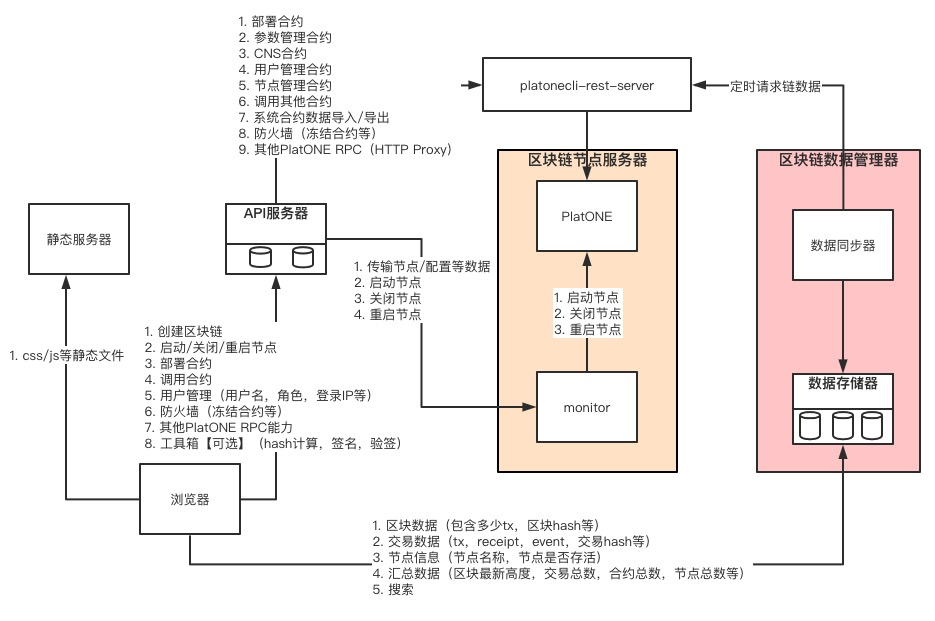

# PlatONE运维管理平台

## 架构设计

**注**

**本期尚未实现的功能包括：**

**1.调用其他合约**

**2.其他PlatONE RPC能力**

**3.系统合约数据导入导出**

**4.浏览器工具箱**

整个系统分为6个独立组件，分别如下：

1. 静态服务器：提供浏览器的静态文件。
2. API服务器：服务器具有用户鉴权和命令转发，签名合约调用和转换等能力，在这些能力的基础上调用`monitor服务`和`PlatONE`，提供部署合约，启动节点，关闭节点，调用合约等能力给浏览器调用。
3. monitor服务：和PlatONE节点部署在一个服务器。提供启动节点，关闭节点，重启节点等能力。
4. 数据同步器：定时通过PRC请求获取PlatONE数据。
5. 数据存储器：接受数据同步器的数据，并持久化到数据库。并提供HTTP接口给浏览器以传输区块链数据。
6. platonecli-rest-server：提供数据包格式重组，签名，验证等功能。

## API服务器

### 用户管理

为每一个后台管理用户申请一个链账户（公钥，私钥，地址），并和后台用户名建立永久映射，并为映射的链账户设置PlatONE链上用户角色。

私钥直接保存在API服务器。

### 鉴权

用户通过用户名/密码的方式登录服务器，获取token，以后的所有请求都需要携带这个token。服务器根据token来验证用户权限。

### 启动/关闭/重启节点

API服务器和Monitor服务之间的通信也是通过HTTP协议。Monitor服务对API服务器发送过来的请求需要进行验证，验证方式是API服务器对请求进行私钥签名，Monitor用公钥进行验签名。公私钥是事先生成的。

### 调用PlatONE RPC

可以任意链接几个PlatONE节点，节点所在服务器可以通过白名单的方式进行请求管理。

API服务器发送的是rawTransaction，也就是说API服务器提供给交易签名。

## Monitor

monitor服务在每一个PlatONE节点服务器都需要部署一份，长期监听HTTP接口，以接受API服务器的请求。

### 节点管理

一个节点的启动需要如下数据：

1. PlatONE客户端软件
2. genesis.json
3. 节点公私钥（用于节点加入网络时的检验等）

在一个新的服务器上部署一个新节点的流程如下：

1. 在目标服务器上安装Monitor服务（方法举例：scp传输到目标服务器，手动启动）
2. API服务器发送链客户端代码和配置数据（genesis.json，节点公私钥）给monitor，monitor收到后进行持久化存储。
3. API服务器发送节点公钥等信息给PlatONE，进行节点添加。
4. API服务器发送节点启动命令。

## 区块链数据管理器

### 数据同步器

定时轮询的策略访问PlatONE RPC接口去主动拉取数据，并把得到的数据验证，加工并发送给`数据存储器`。

#### 拉取数据策略

每次访问不同的节点，并拉取到最新高度的区块。因为每次随机挑选节点拉取数据，可以通过区块hash来验证数据的正确性，提高数据安全性的程度。

### 数据存储器

提供数据存储接口和查询接口。把接受到的数据存储持久化到数据库。预防数据越来越多，选择sharding分布式模型的MongoDB为存储数据库。

